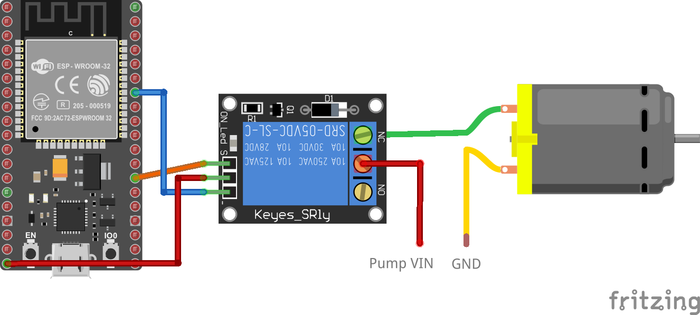
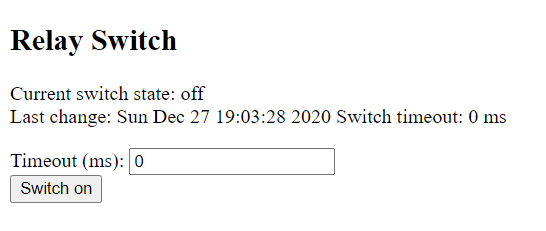

# ESP32 relay switch

* [Overview](#Overview)<br>
* [Requirements](#Requirements)<br>
* [Wiring](#Wiring)<br>
  * [Example wiring for watering](#Example-wiring-for-watering)<br>
* [Build and run](#Build-and-run)<br>
* [Communication interfaces](#Communication-interfaces)<br>
  * [HTML web interface](#HTML-web-interface)<br>
  * [HTTP API](#HTTP-API)<br>
  * [MQTT](#MQTT)<br>
* [Configuration constants](#Configuration-constants)<br>

## Overview

This projects implements firmware for ESP/32 SoC which serves as remote wireless switch. This switch can control home appliances such as lights,
boiler or watering pump. One of example use cases is project [kyberpunk/watering-service](https://github.com/kyberpunk/watering-service).

Firmware is written in C using official [ESP-IDF](https://docs.espressif.com/projects/esp-idf/en/latest/esp32/get-started/index.html#step-2-get-esp-idf) SDK. [Parson](https://github.com/kgabis/parson) library is used for JSON serialization.

**Features**:
* Remote switching on/off the relay
* Multiple communication interfaces
* Safety timeout mechanism which will change switch position after configured time
* Time synchronization using SNTP

Device uses SNTP protocol for time synchronization. Internet network must be accessible form subnet where the device is connected or IP address of local NTP server (e.g. Raspberry Pi) must be provided. Switch state does not persist after restart.

## Requirements

* [ESP-IDF](https://docs.espressif.com/projects/esp-idf/en/latest/esp32/get-started/index.html#step-2-get-esp-idf) installed (at least version 4.2)
* ESP-32 SoC or [development board](https://www.espressif.com/en/products/devkits)
* Bistable relay with 5V coil

## Wiring

Wiring is quite simple. 5V relay is controlled by GPIO4 pin of ESP-32 which is configured as output. You can use development module or standalone relay with transistor for powering the coil.

### Example wiring for watering

Following example shows prototype wiring for controlling water pump. For symplicity development boards (ESP32S-HiLetgo) are used. There is plenty of water pumps on Amazon on Aliexpress which can be powered by 5V source and are efficient enough to water room plants.



## Build and run

Firmware is built using IDF-SDK build toolchain. See more information how to install the toolchain in [official guide](https://docs.espressif.com/projects/esp-idf/en/latest/esp32/get-started/).

Build firmware binary:

```
idf.py build
```

Flash firmware using ESP-32 bootloader:

```
idf.py -p <Serial port> clean flash
```

Firmware should be running immediately after powering (reseting) the ESP-32 device.

## Communication interfaces

There are several available interfaces which can be used for controlling the switch depending on use case.

### HTML web interface

There is simple web interface on device port 80 which can be used for direct control. HTML page shows current state and provides actions to turn on/off the switch including setting the timeout. It is designed for use cases when switch is controlled directly by user.



### HTTP API

Firmware implements also HTTP API with JSON formated payloads. It can be used for consuming states and controlling switch by another application or service. HTTP API is listening on port 80. All requests to API use /api prefix.

Following requests are available:

**`GET /api/state`: Get current state of switch**

Response body payload example:

```
{
    "id": "SWITCH1",
    "switchedOn": false,
    "timeout": 0,
    "lastChangeUtcMillis": 1609095808743
}
```

* id - unique identifier of device
* switchedOn - true when switched on, false when switched off
* timeout - switch timeout in ms
* lastChangeUtcMillis - UTC timestamp in ms of last switch position change

**`POST /api/state`: Change state of the switch**

Request body payload example:

```
{
    "switchedOn": true,
    "timeout": 2000
}
```

* switchedOn - true for switch on, false for switch off
* timeout - switch timeout in ms after which is the switch position reverted, when set to 0 then position is permanent

Response body payload example:

```
{
    "id": "SWITCH1",
    "switchedOn": true,
    "timeout": 2000,
    "lastChangeUtcMillis": 1609096477373
}
```

### MQTT

Firmware implements MQTT API with custom topics. It can be used for consuming states and controlling switch by another application or service. It is useful e.g for processing of real-time switching events. MQTT messages use JSON serialization.

**Consuming switch states**

Every time the switch state changes it is sent to topic `switch/state`. Message with following payload is sent:

```
{
    "id": "SWITCH1",
    "switchedOn": false,
    "timeout": 0,
    "lastChangeUtcMillis": 1609095808743
}
```

* id - unique identifier of device
* switchedOn - true when switched on, false when switched off
* timeout - switch timeout in ms
* lastChangeUtcMillis - UTC timestamp in ms of last switch position change

**Changing switch state**

Switch state can be changed by sending following message to the topic `switch/{ID}/state` where {ID} is unique device ID:

```
{
    "switchedOn": true,
    "timeout": 2000
}
```

* switchedOn - true for switch on, false for switch off
* timeout - switch timeout in ms after which is the switch position reverted, when set to 0 then position is permanent

## Configuration constants

Firmware settings such as connection credentials can be configured in [main/user_config.h](main/user_config.h)

| Constant            | Description                                                             |
| ------------------- | ----------------------------------------------------------------------- |
| WIFI_SSID           | Wi-Fi ssid                                                              |
| WIFI_PASSWORD       | Wi-Fi password                                                          |
| RELAY_GPIO_NUM      | GPIO pin number used for relay (default 4)                              |
| HTTP_HTML_ENABLE    | Set to 1 to enable HTML web interface or 0 to disable (default 1)       |
| HTTP_JSON_ENABLE    | Set to 1 to enable HTTP API or 0 to disable (default 1)                 |
| MQTT_ADAPTER_ENABLE | Set to 1 to enable MQTT interface or 0 to disable (default 1)           |
| HIGH_ON             | Set to 1 if relay is connected by high input or 0 otherwise (default 0) |
| MQTT_BROKER_HOST    | IP address or DNS name of MQTT broker                                   |
| SWITCH_ID           | Unique device ID - important for MQTT (default SWITCH1)                 |
| NTP_SERVER          | NTP server DNS name or IP (default pool.ntp.org)                        |
